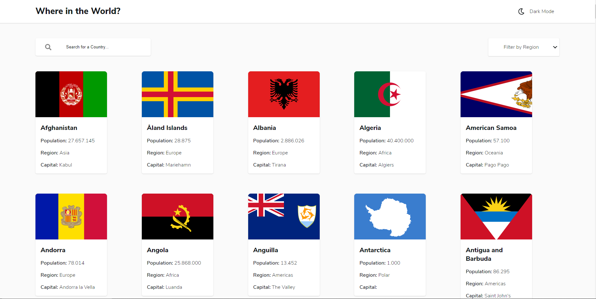

# Frontend Mentor - REST Countries API solution

This is a solution to the [REST Countries API with color theme switcher challenge on Frontend Mentor](https://www.frontendmentor.io/challenges/rest-countries-api-with-color-theme-switcher-5cacc469fec04111f7b848ca). Frontend Mentor challenges help you improve your coding skills by building realistic projects. 

## Table of contents

- [Frontend Mentor - REST Countries API solution](#frontend-mentor---rest-countries-api-solution)
  - [Table of contents](#table-of-contents)
  - [Overview](#overview)
    - [The challenge](#the-challenge)
    - [Screenshot](#screenshot)
    - [Links](#links)
    - [Built with](#built-with)
    - [What I learned](#what-i-learned)
  - [Author](#author)

## Overview

### The challenge

Users should be able to:

- See all countries from the API on the homepage
- Search for a country using an `input` field
- Filter countries by region
- Click on a country to see more detailed information on a separate page
- Click through to the border countries on the detail page
- Toggle the color scheme between light and dark mode *(optional)*

### Screenshot



### Links

- Live Site Here: [search-country-api](https://search-country-api.netlify.app/index.html)
- Solution Here: [Image Site](https://prnt.sc/1s5525n)

### Built with

- Semantic HTML5 markup
- CSS custom properties
- Flexbox
- CSS Grid
- Mobile-first workflow
- API Fetch
### What I learned

These functions check the value by Theme in Local Storage. If the value by Theme be equal dark-mode, the tag ```html``` will have an class dark-mode.
```html
<html lang="en" class="dark-mode">
```
If Theme value in local storage is empty, the class in the tag will be empty.

```html
<html lang="en" class="dark-mode">
```

See below the code:

```js
function setTheme(themeName) {
    localStorage.setItem('theme', themeName);
    document.documentElement.className = themeName;
}

// function to toggle between light and dark theme
function toggleTheme() {
   if (localStorage.getItem('theme') === 'dark-mode'){
       setTheme('');
   } else {
       setTheme('dark-mode');
   }
}

// Immediately invoked function to set the theme on initial load
(function () {
   if (localStorage.getItem('theme') === 'dark-mode') {
       setTheme('dark-mode');
   } else {
       setTheme("");
   }
})();
```
## Author

- Website - [search-country-api](https://search-country-api.netlify.app/index.html)
- Frontend Mentor - [@jack970](https://www.frontendmentor.io/profile/yourusername)